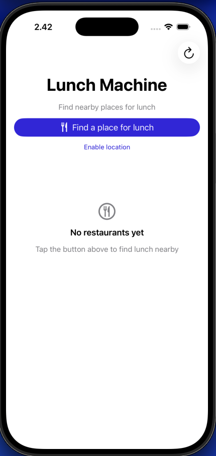
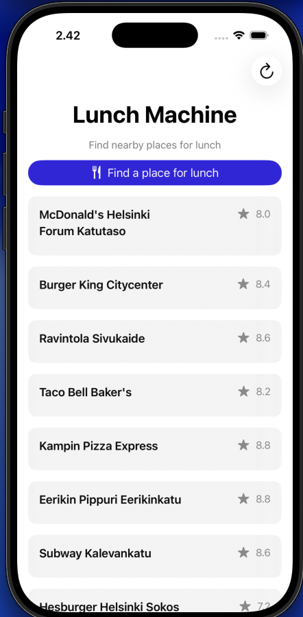

# 🍔 Lunch Machine

Lunch Machine is a simple iOS application built with **SwiftUI** that helps users discover nearby restaurants based on their current location.

This project was built to practice real-world iOS development concepts such as location permissions, asynchronous networking, clean architecture, and user experience state handling.

---

## 🚀 Features

- Request and handle location permission
- Fetch nearby restaurants using a public API
- Display restaurant list with pagination (“Show more”)
- Loading, empty, and error states
- Pull-to-refresh via toolbar action
- Custom Launch Screen & App Icon

---
## 🧠 Architecture Overview

The app follows a lightweight, maintainable architecture with clear separation of responsibilities:

- **Views**  
  SwiftUI views responsible only for UI rendering and reacting to state changes.

- **Repository**  
  `RestaurantsRepository` handles data fetching, location access, and communicates with the API layer.

- **Services**  
  Networking and location logic are abstracted behind protocols to improve testability.

- **Models**  
  Separate API models (`WoltResults`) and domain models (`Restaurant`) to avoid tightly coupling the UI to backend responses.

This structure keeps the codebase testable, easy to reason about, and ready for future refactoring.

## 🛠 Tech Stack

- **Language:** Swift  
- **UI:** SwiftUI  
- **Concurrency:** async / await  
- **iOS APIs:** CoreLocation  
- **Architecture:** Repository-based separation (MV-style)  
- **Tools:** Xcode, Git, SwiftLint  

## ▶️ How to Run

1. Clone the repo:
```bash
git clone https://github.com/KhanhNBL/Lunch-Machine.git
cd Lunch-Machine
```
## 📸 Screenshots/Demo 

<p float="left">
  
  
</p>

https://github.com/KhanhNBL/Lunch-Machine/blob/main/AppLaunching.mov

## 📍 Simulator Location (Important)

The API used in this project only returns data in supported regions.

If no restaurants appear, please set the Simulator location to:

Simulator → Features → Location → Custom Location

Latitude: 60.1699

Longitude: 24.9384
(Helsinki)

## 🗂 Project Structure

-Views/ – SwiftUI screens and UI components

-Models/ – Codable API response models (WoltResults)

-Services/ – Networking, repository, and location manager

-Extensions/ – Helper extensions and data mapping logic

## ⚠️ Known Limitations

-Restaurant availability depends on API coverage and simulators location

-No restaurant detail screen (kept intentionally simple)

-No offline caching

## 🔮 Future Improvements

- Add more ViewModel-level unit tests
- Improve error handling with retry actions
- Introduce caching for offline usage
- Refine architecture towards a more explicit MVVM or unidirectional data flow

## 👤 Author

Khanh Nguyen
- GitHub: https://github.com/KhanhNBL
- LinkedIn: https://www.linkedin.com/in/khanh-nguyen-ba-long-b881341aa/
